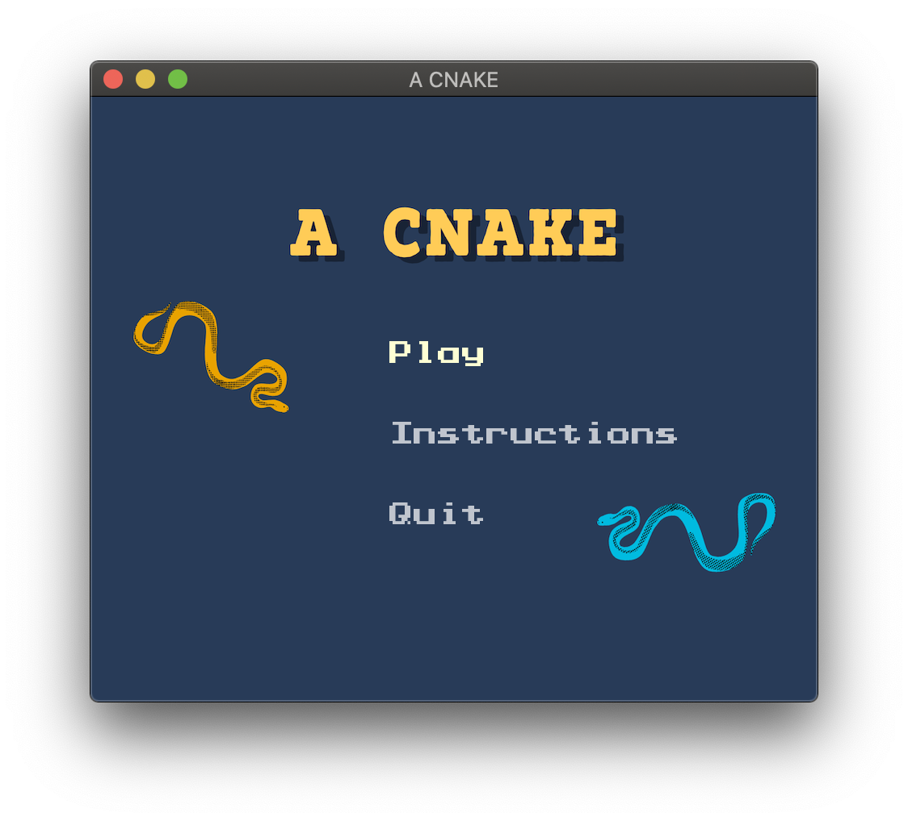

# A CNAKE

An uni year 1 final project for IM1003 Programming Design at National Taiwan University. The simple but fascinating game is developed all by ourselves with a little help from YouTube. Feel free to make it cooler. 

The entire project is built natively on macOS with some *terminal commands* and *Visual Studio Code* (that's why there's a `.vscode` setting folder and a `acnake.code-workspace` for opening a workspace in VS Code.) In fact, any text editors can do the job. `SFML` library is required to build this game. 

Developing this project does not require any IDE nor Windows (you can definitely run it on Windows though). Building this project is easy (not sure for Windows, tell us after you successfully build!) on any platform.

The project is built for learning purpose - mainly `C++`, `SFML`, `Game Developing`, `git`. I haven't decided which license to use yet (maybe it will be distributed under MIT license). But feel free to modify the code and submit merge requests for better gaming experience.

## How to Play
Two pre-set snakes are for you (and your friend) to play:

Instructions (can be seen in the game itself):

Demo:

See demo on YouTube:
<!-- blank line -->
<figure class="video_container">
  <iframe width="560" height="315" src="https://www.youtube.com/embed/ZDKSKEFhWOg" frameborder="0" allow="accelerometer; autoplay; encrypted-media; gyroscope; picture-in-picture" allowfullscreen></iframe>
</figure>
<!-- blank line -->

## To Do
### Current Version Game (v1.4): 
- [ ] 1. Separate main.cpp into different classes
- [ ] 2. Minor bugs 

### v2 or later: 
- [ ] 1. Settings
   - [ ] 1. sound on/off
   - [ ] 2. speed
- [ ] 2. place bomb, and your lenth will decrease
- [ ] 3. Single player mode
- [ ] 4. connected through server
- [ ] 5. Even more players
- [ ] 6. Shoot from mouth lol
- [ ] 7. Speed up

## Build
### macOS
Pre-requisite: 
+ SFML
+ Homebrew

If you don't have the above programs loaded on your mac, make sure to download [homebrew](https://brew.sh) first.
Type `/usr/bin/ruby -e "$(curl -fsSL https://raw.githubusercontent.com/Homebrew/install/master/install)"` on your terminal prompt. 

Download **SFML** through terminal: 
Type `brew install SFML`. (If your user setting doesn't fit the system requirement, i.e. your are not the root user, please follow the instruction on your terminal prompt.)

Download this repository, copy and paste `git clone https://gitlab.com/icheft/snake.git` in your terminal. 

It should create a folder name **snake**.

Go to your project directory by typing `cd snake`, then type in `make`.

You should be able to run the game by typing `./A\ Cnake`. Or, you can follow the instructions shown on your terminal prompt. 

#### Clean
Type `make clean` to clean the project folder. 

### Windows 
:) No offense. But it should be easy :)

## Archive
- [x] 1. win, lose, 平手, play again windows
    + Add player 1 (blue snake) wins
    + Add player 2 (yellow snake) wins
    + Add Fair play
    + Play again button(?)
- [x] 2. Add sound effects
- [x] 3. Add pause state (no beautiful UI though, the frame will be paused however.)
- [x] 4. Instruction window

## Contributors
+ Pony
+ Watermelon Man
+ Other resources from the Internet (Mostly from [SFML-dev.org](https://www.sfml-dev.org))

## Credits
Background music:
► Music Credit: SUNDANCE
Track Name: "Perséphone - Retro Funky (SUNDANCE remix)"
Music By: SUNDANCE @ [https://soundcloud.com/sundancemusic](https://soundcloud.com/sundancemusic)
The SUNDANCE Official Website is HERE - [http://lefthandmusic.fr/](http://lefthandmusic.fr/)
Follow SUNDANCE on BandCamp: [https://sundancemusic.bandcamp.com/](https://sundancemusic.bandcamp.com/)
License for commercial use: Creative Commons Attribution 3.0 Unported (CC BY 3.0) [https://creativecommons.org/licenses/](https://creativecommons.org/licenses/)...
Music promoted by NCM [https://goo.gl/fh3rEJ](https://goo.gl/fh3rEJ)
